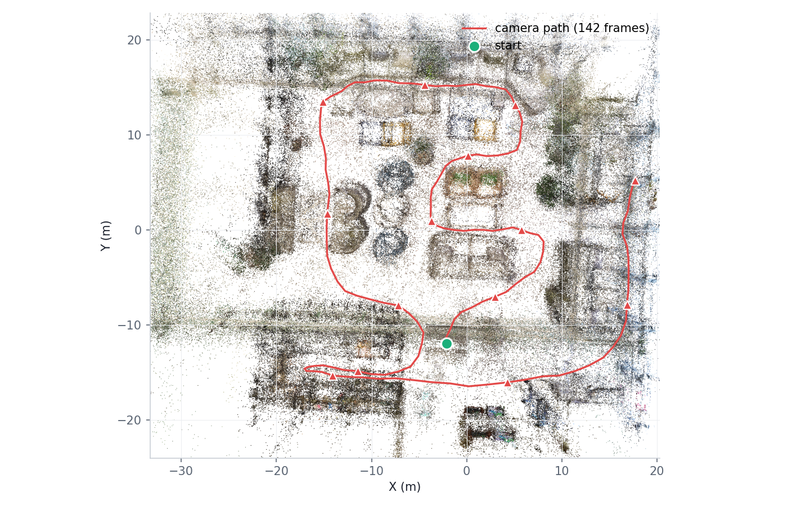
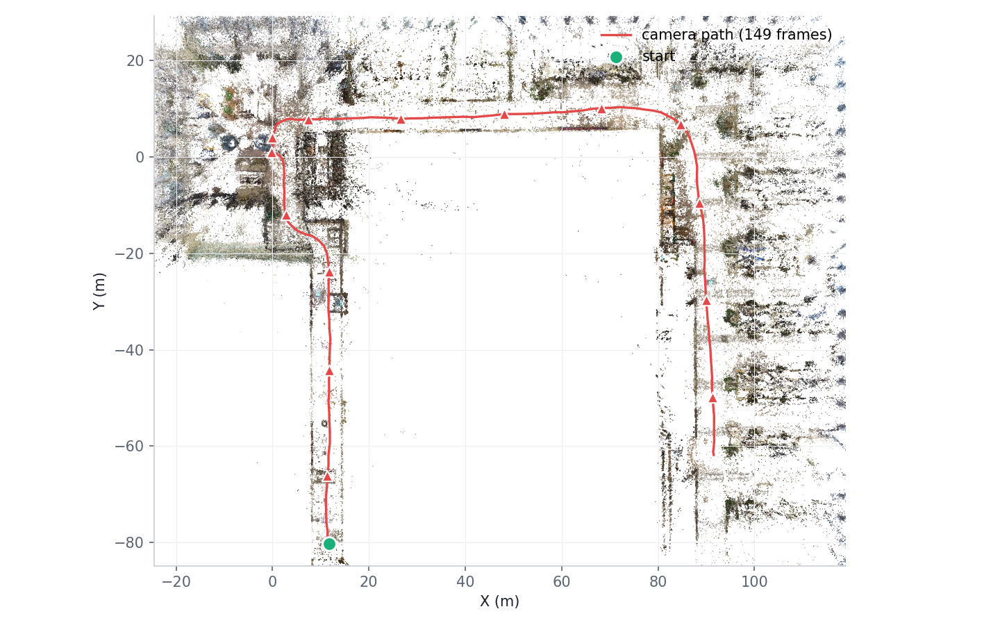
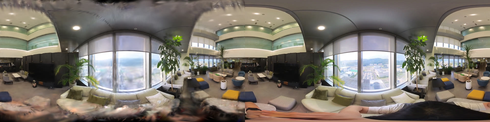
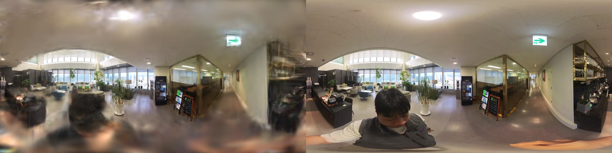

# 360 Gaussian Splatting

> Based on [inuex35/360-gaussian-splatting](https://github.com/inuex35/360-gaussian-splatting) — original 360° equirectangular Gaussian Splatting implementation. This repository adds dense-initialization tools and novel-view rendering scripts.

<div align="center">

  

  <em>Novel-view flythrough reconstructed from a 71-second Insta360 walk (142 frames, my own capture).<br>
  Original demo by inuex35: <a href="https://www.youtube.com/watch?v=AhWHeEB8-vc">YouTube</a></em>

</div>

This repository contains programs for reconstructing space using OpenSfM and Gaussian Splatting. For original repositories of OpenSfM and Gaussian Splatting, please refer to the links provided.

## Results on my own 360 captures

Full pipeline runs on videos I shot with an Insta360 (equirectangular 3840×1920, ~70s walks, frames extracted at 2fps):

| Scene | Views | SfM ([ind-bermuda-opensfm](https://github.com/inuex35/ind-bermuda-opensfm)) | Init points (MVS dense) | Test PSNR (full-res, held-out) |
|---|---|---|---|---|
| Office lounge | 142 | 142/142 registered | 11.0M → 1.5M sampled | 19.70 dB |
| Lobby + corridor | 149 | 149/149 registered | 5.4M → 1.5M sampled | 19.99 dB |

Pipeline: sequential-matching SfM (spherical camera) → `undistort` + `compute_depthmaps` (MVS) → dense init via `tools/make_dense_recon.py` → `train.py --panorama --eval`. See the dense initialization recipe below — on sparse captures it was worth **+2.3 dB** over training from SfM sparse points. Novel-view videos are rendered with `render_novel.py`.

<div align="center">
  <table>
    <tr>
      <td></td>
      <td></td>
    </tr>
    <tr>
      <td align="center"><em>SfM camera path through the dense cloud — lounge (142 frames)</em></td>
      <td align="center"><em>lobby + corridor (149 frames)</em></td>
    </tr>
  </table>

  
  <br><em>Held-out view — GS render (left) vs ground truth (right), lounge</em><br><br>
  
  <br><em>Held-out view — GS render (left) vs ground truth (right), lobby + corridor</em>

</div>

# Support me
This is just my personal project.
If you've enjoyed using this project and found it helpful, 
I'd be incredibly grateful if you could chip in a few bucks to help cover the costs of running the GPU server. 
You can easily do this by buying me a coffee at 
https://www.buymeacoffee.com/inuex35. 

## Environment Setup

### Cloning the Repository

Clone the repository with the following command:

```bash
git clone --recursive https://github.com/inuex35/360-gaussian-splatting
```

### Creating the Environment

In addition to the original repository, install the following module as well:

```bash
pip3 install submodules/diff-gaussian-rasterization submodules/simple-knn plyfile pyproj
```

### For omnigs rendering

You can use omnigs implementation. Checkout diff-gaussian-rasterization to omnigs branch.

```bash
cd submodules/diff-gaussian-rasterization
git checkout omnigs
```

### For Depth and Normal Rendering

If you use depth and normal for training, use depth_normal_render

```bash
git clone --recursive -b depth_normal_render https://github.com/inuex35/360-gaussian-splatting 
```

and 

```bash
cd 360-gaussian-splatting
git clone https://github.com/inuex35/360-dn-diff-gaussian-rasterization submodules/360-dn-diff-gaussian-rasterization
pip3 install submodules/360-dn-diff-gaussian-rasterization submodules/simple-knn plyfile pyproj openexr imageio
```

## Training 360 Gaussian Splatting

First, generate point clouds using images from a 360-degree camera with OpenSfM. Refer to the following repository and use this command for reconstruction:
Visit https://github.com/inuex35/ind-bermuda-opensfm and opensfm documentation for more detail.

```bash
bin/opensfm_run_all your_data
```

Make sure the camera model is set to spherical. It is possible to use both spherical and perspective camera models simultaneously.

After reconstruction, a `reconstruction.json` file will be generated. You can use opensfm viewer for visualization.


Assuming you are creating directories within `data`, place them as follows:
```
data/your_data/images/*jpg
data/your_data/reconstruction.json
```

Then, start the training with the following command:

```bash
python3 train.py -s data/your_data --panorama
```

After training, results will be saved in the `output` directory. For training parameters and more details, refer to the Gaussian Splatting repository.

## Training parameter


Parameters for 360 Gaussian Splatting are provided with default values in 360-gaussian-splatting/arguments/__init__.py.

According to the original repository, it might be beneficial to adjust position_lr_init, position_lr_final, and scaling_lr.

Reducing densify_grad_threshold can increase the number of splats, but it will also increase VRAM usage.

densify_from_iter and densify_until_iter are also related to densification.

You should use small densify_grad_threshold like 0.00002 for equirectangular.


## Dense initialization recipe (recommended for sparse-view captures)

Instead of training from sparse SfM points, densify the initial point cloud with OpenSfM MVS:

```shell
bin/opensfm undistort data/your_data
bin/opensfm compute_depthmaps data/your_data
python tools/make_dense_recon.py data/your_data data/your_data_dense
```

This replaces `points` in reconstruction.json with ~400k MVS points (camera poses unchanged).
On a 12-view 360 capture this improved held-out test PSNR by +2.3 dB and removed most floaters,
using the default densify_grad_threshold (2e-5 makes the gaussian count explode on 12GB GPUs —
use it only with ample VRAM). `tools/make_recon_stanford.py` builds reconstruction.json directly
from Stanford 2D-3D-S pano poses + global_xyz without running SfM.
